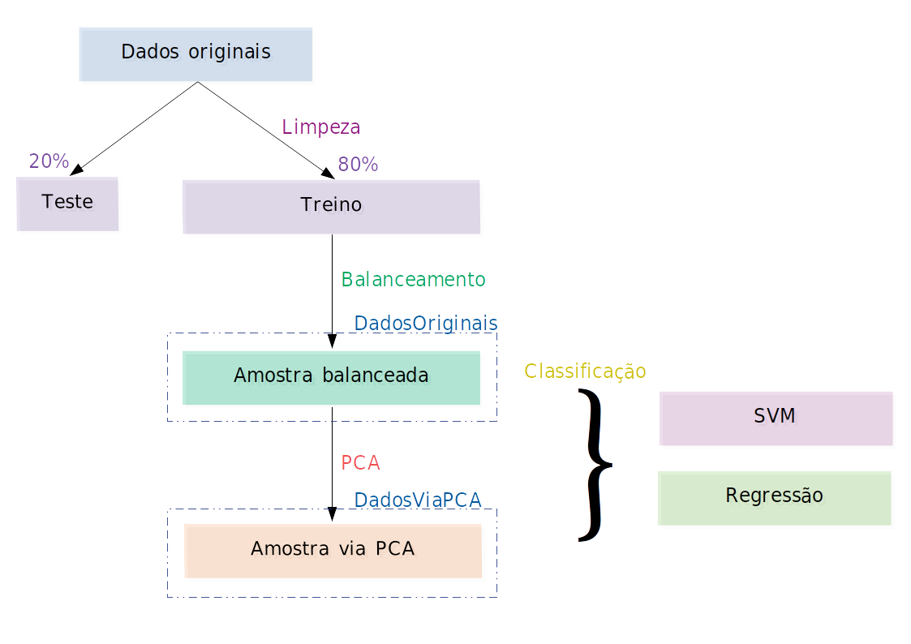
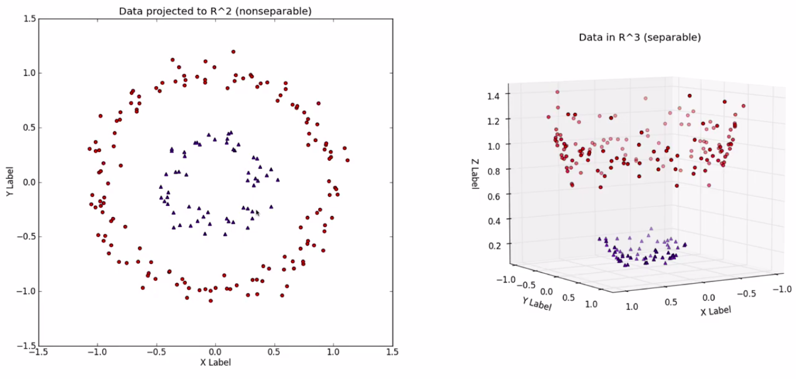
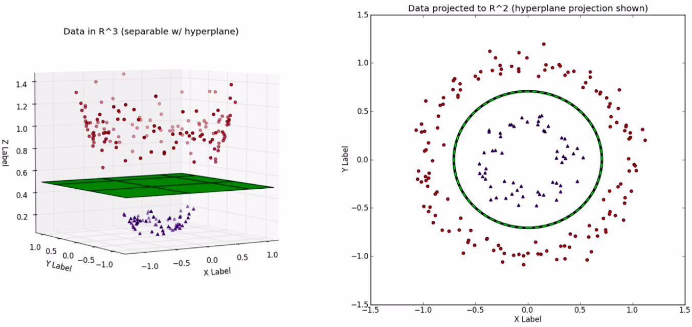
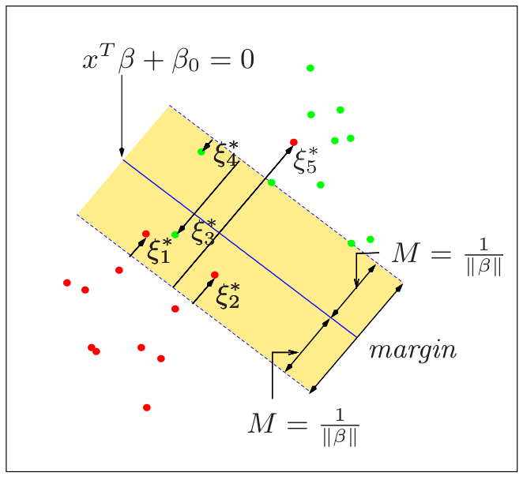

```{r setup, include=FALSE}
#knitr::opts_chunk$set(echo = TRUE, warning = FALSE, error = FALSE)
knitr::opts_chunk$set(message = FALSE, warning = FALSE, error = FALSE)
```

## ETAPAS DO PROJETO


## DESCRIÇÃO DO PROBLEMA E ABORDAGEM
<div style="text-align: justify">
### Tópico
1. Descrever o processo de desenvolvimento e modelagem de um problema de classificação
2. Os resultados foram comparados utilizando as métricas:
    * acurácia: fração de instância classificadas corretamente
    * precisão: fração de classificações corretas para uma determinada classe

### Descrição
Este trabalho busca descrever o processo de desenvolvimento e modelagem de um problema de classificação. Utilizamos uma base de dados que contém medições de vento, temperatura e radiação solar para classificar se um dia terá nível de ozônio elevado, 1, ou nível de ozônio normal, 0.

Para isso, limpamos os dados para retirar exemplos com valores faltantes, separamos em 80% para treino e 20% para teste, balanceamos o conjunto de treino e aplicamos o método PCA sobre o mesmo, para reduzir a dimensão dos dados e obter uma amostra via PCA. Por fim, submetemos a amostra balanceada dos dados oririginais e a amostra obtida via PCA para treinar os modelos obtidos utilizando os métodos SVM e Regressão para classificação. Por fim, comparamos os resultados utilizando as métricas aurácia e pracisão.


## CONJUNTO DE DADOS
### Tópicos
1. Base de dados contém medições de vento, temperatura e radiação solar para classificar se um dia terá nível de ozônio elevado, 1, ou nível de ozônio normal, 0
2. Coletadas durante 6 anos
3. A base contém 2536 infâncias e 73 atributos
4. Limpeza dos dados: excluímos linhas com dados faltantes

### Descrição
Esse conjunto de dados possui medições coletadas durante 6 anos, de 1998 até 2004 em Houston, Galveston e Brazoria, sobre a concentração de ozônio. O objetivo é prever se um determinado dia terá nível de ozônio elevado ou não, dadas as informações de vento, temperatura e radiação.

O conjunto possui 2536 instâncias e 73 atributos. É um problema de previsão de classificação, onde o atributo final indica o valor da classe, sendo "1" para um dia com nível de ozônio elevado e "0" para um dia com nível de ozônio normal. Abaixo segue uma descrição dos dados [1,2].

| Descrição |
| ----------- | ----------- |
|Características do conjunto:   |Multivariado, Séries Temporais   |
|Número de instâncias:   |2536   |
|Características dos atributos:   |Real   |
|Número de atributos:   |74   |
|Objetivo:   |Classificação   |

Nomenclatura dos atributos: todos os atributos que inicial em "T" referem-se a temperatura média em uma hora diferente ao longo do dia; todos que iniciam com "WS" referem-se a velocidade do vento em vários momentos; os que iniciam em "S" referem-se ao nível de radiação solar para o dia; e os demais não foram detalhados no artigo [1].

```{r, echo=FALSE}
#install.packages("car", dependencies=TRUE, repos='http://cran.rstudio.com/')
library(psych)
library(psy)
library(tidyr)
library(ggplot2)
library(purrr)
library(gclus)
library(corrplot)
library(visdat)
library(prettydoc)
library(scatterplot3d)
library(e1071)
library(caret)
library(broom)
library(DMwR)
library(corrgram)
library(MASS)
library(dplyr)          
library(magrittr)       
library(gridExtra) 
library(ResourceSelection)
library(car)
```

```{r dados}
x <- read.csv("/home/danielle/Desktop/Mathematics/ICMC/conteudo/8o-Semestre/Introdução à Ciência de Dados-SCC0275/trabalho/CD/relatorioCD/eighthr.csv", dec=".", sep = ",", header=FALSE, stringsAsFactors=FALSE, na = "?") 
colnames(x) <- c("Date","WSR0", "WSR1", "WSR2", "WSR3", "WSR4", "WSR5", "WSR6", "WSR7", "WSR8", "WSR9", "WSR10", "WSR11", "WSR12", "WSR13", "WSR14", "WSR15", "WSR16", "WSR17", "WSR18", "WSR19", "WSR20", "WSR21", "WSR22", "WSR23", "WSR_PK", "WSR_AV", "T0", "T1", "T2", "T3", "T4", "T5", "T6", "T7", "T8", "T9", "T10", "T11", "T12", "T13", "T14", "T15", "T16", "T17", "T18", "T19", "T20", "T21", "T22", "T23", "T_PK", "T_AV", "T85", "RH85", "U85", "V85", "HT85", "T70", "RH70", "U70", "V70", "HT70", "T50", "RH50", "U50", "V50", "HT50", "KI", "TT", "SLP", "SLP_", "Precp", "Classification")
```

#### Dados faltantes
```{r}
vis_miss(x)
```

#### Excluindo linhas com dados faltantes(Limpeza)
```{r}
x <- drop_na(x)
# ignorando o campo Date
x <- x[, 2:74]
nroLinhas = nrow(x)
nroColunas = ncol(x)
```

## ANÁLISE EXPLORATÓRIA
### Tópicos
1. Dados estão estruturados no formato de tabela e os atributos são todos do tipo contínuo
2. A matriz de covariâncias e correlações dos atributos nos permite identificar variáveis redundantes

### Descrição
#### Matriz de covariâncias e correlações dos atributos
Como estamos analisando muitas variáveis, a covariância e a correlação podem nos ajudar, de maneira rápida, a identificar variáveis redundantes, pois se duas variáveis tem alta correlação pode ser que a informação de uma esteja presente na outra, portanto, podemos remover uma das variáveis. Ainda assim, o mais correto é fazer uma análise mais cuidadosa nesses casos e é o que faremos realizando Decomposição Espectral via PCA.

```{r, echo=FALSE}
# Tudo junto
matCor <- cor(x[,1:nroColunas])
corrplot(matCor, method="color")

# 1º quadrante 
corrplot(matCor[1:26, 1:26], method="color")

# 2º quadrante 
corrplot(matCor[1:26, 27:53], method="color")

# 3º quadrante 
corrplot(matCor[1:26, 54:73], method="color")

# 4º quadrante 
corrplot(matCor[27:53, 1:26], method="color")

# 5º quadrante 
corrplot(matCor[27:53, 27:53], method="color")

# 6º quadrante 
corrplot(matCor[27:53, 54:73], method="color")

# 7º quadrante 
corrplot(matCor[54:72, 1:26], method="color")

# 8º quadrante 
corrplot(matCor[54:72, 27:53], method="color")

# 9º quadrante 
corrplot(matCor[54:72, 54:73], method="color")
```

A correlação é a versão normalizada da covariância que mostra o grau de associação da relação linear entre as variáveis. A covariância de duas variáveis é uma medida da variabilidade conjunta destas variáveis, se elas tem covariância positiva tendem a mostrar um comportamento semelhante e se a covariância é negativa então as variáveis tendem a mostrar um comportamento oposto. A correlação varia $-1\leq \rho \leq 1$ e sua fórmula, sendo x e Y va's integráveis, é dada por:
$\rho (X,Y) = \frac{Cov(X,Y)}{\sigma_X \sigma_Y} = E[(\frac{X-E(X)}{\sigma_X })(\frac{Y-E(Y)}{\sigma_Y }) ]$
$\frac{X-E(X)}{\sigma_X } é visto como uma padronixação de X, com esperança 0 e variância 1.

## PRÉ-PROCESSAMENTO
### Tópicos
1. Dados separados em 80% para treino e 20% para teste
2. O desbalanceamento causa problemas na hora de fazer a classificação
3. Solução: selecionar uma amostra dos dados de treino que contenha o mesmo número de exemplos em cada classe
4. Amostra: 103 exemplos da classe 0 e 103 exemplos da classe 1

### Descrição

#### Estratificando em treino e teste
Nesta etapa, os dados, após a limpeza, foram dividos em 80% treino e 20% teste:

```{r}
set.seed(1729)
smp_size <- round(0.80 * nrow(x))

train_ind = sample(1:nrow(x), size = smp_size)

xTreino <- x[train_ind, ]
xTeste <- x[-train_ind, ]

qtdClassZero = sum(xTreino[,"Classification"] == 0)
print(paste('Qtd de exemplos da classe 0: ', qtdClassZero))

qtdClassUm = sum(xTreino[,"Classification"] == 1)
print(paste('Qtd de exemplos da classe 1: ', qtdClassUm))

print(paste('Proporção de exemplos da classe 1 sobre o total: ', format((qtdClassUm/(qtdClassUm+qtdClassZero)), digits = 2)))
```
  
#### Balanceando os dados 
O desbalanceamento, em geral, causa problemas na hora de fazer a classificação. Para resolver isso podemos utilizar um método de amostragem aleatória, i.e, retirar, dos dados originais(no caso os dados de treino), amostras que contenham números de exemplos de cada classe balanceados.<br />
Note que, o nosso conjunto de dados é muito desbalanceado, i.e, temos muito mais exemplos da classe 0 do que da classe 1, o que, futuramente, pode acarretar problemas de overfitting:
```{r}
# selecionando os 103 exemplos da classe 1
idsUm = which(xTreino[,73] == 1)
n <- as.numeric(length(idsUm))
#idsUm
# selecionando 103 exemplos aleatórios da classe 0
idsZero = which(xTreino[,73] == 0)
set.seed(2019)
idsZeroSelec = sample(idsZero, n)
#idsZeroSelec


# matriz de dados formada por uma amostra do conjunto original
xSample <- rbind(xTreino[idsZeroSelec,], xTreino[idsUm, ])
xTreino <-xSample
table(xSample$Classification)
```

Sendo assim, iremos selecionar 103 exemplo da classe 0 de modo aleatório. Assim, formamos um conjunto de dados composto por 103 exemplos da classe 0 e 103 exemplos da classe 1. Esse processo de balanceamento dos dados é chamado de **amostragem aleatória estratificada uniforme (não se dá peso aos estratos/classes)**.


#### Plotando os dados de treino
O gráfico de dispersão abaixo é uma exemplificação do efeito da correlação entre duas variáveis de vento: há a relação linear entre elas e, por ter comportamento crescente, a correlação é positiva.

```{r}
xSample[,73]<- as.factor(xSample[,73])
ggplot(xSample, aes(x = WSR0, y = WSR1, color = Classification)) + geom_point()
```

A seguir, aplicaremos o PCA para reduzir a dimensão dos dados, antes de realizar a classificação por meio dos métodos de Regressão e SVM.

## MODELAGEM

### <font color="#5B2C6F">PCA</font>
### Tópicos
1. Temos 73 variáveis explicativas -> dimensão elevada -> aplicando PCA -> redução na dimensionalidade
2. Observando a magnitude dos autovalores e a proporção da variância explicada dos CP (gráficos abaixo):
    * 6 primeiras CP, que explicam 0.98069 da variância, para representar os dados
    * estamos usando apenas $\frac{6}{73} \times 100(\%) =8,23\%$ de informação para fazer a predição
3. Dados ajustados (via PCA): multiplicamos a matriz das 6 CP selecionadas pela matriz que contém as novas coordenadas das observações no subespaço gerado pelas 6 CP
4. Utilizaremos o SVM e a Regressão para classificar a amostra de treinamento dos dados originais e a amostra com os dados ajustados -> primeiro, comparar os resultados obtidos com ambas e, segundo, comparar os métodos

### Descrição
Os dados consistem em 2536 observações e 74 variáveis, sendo o primeira coluna a data que é desconsiderada. Portanto, temos 73 variáveis explicativas, o que nos permite consider dimensão elevada. Utilizaremos o **PCA** com o objetivo de obter redução na dimensionalidade do problema.

Usando a função `prcomp()` obtemos os autovalores e autovetores da matriz de variância e covariância $\Sigma$, e a matriz com as novas coordenas das observações nas variáveis CP (**Componentes Principais**).

```{r}
pca.treino <- prcomp(xTreino)
```

<!--
A seguir, alguns dos vetores próprios (loadings) da matriz, i.e, os coeficientes das combinações lineares das observações que definem as novas variáveis (CP):
```{r, echo=FALSE}
pca.treino$rotation[, 1:4]
```
-->
Com isso, estudamos a magnitude dos autovalores e a proporção da variância explicada dos componentes principais (CP), i.e,  $\frac{\hat{\lambda}_{j}}{\sum_{j=1}^{p} \hat{\lambda}_{j}}$.

```{r}
#summary(pca.treino)
R <- pca.treino$sdev

aux<- R^2 / sum(R^2)
plot(aux, type="b", pch=16, main="Scree plot", ylab="Proporção da Variância Explicada", xlab="ordem da componente")
abline(h = aux[6],  v = 6, col=c("red","blue"), lwd=2, lty= 3)
axis(1, at= 6, labels=6, col.axis="blue")

plot(cumsum(R^2 / sum(R^2)), type="b", pch=16,
     main="Scree plot", ylab="Acumulada", xlab="ordem da componente")
abline(h = 0.98069,  v = 6, col=c("red","blue"), lwd=2, lty= 3)
axis(1, at= 6, labels=6, col.axis="blue")

```

Com base na proporção da variância explicada, podemos tomar as 6 primeiras CP, que explicam **0.98376** da variância, para representar os dados, pois cada CP/Eixo é uma combinação linear das variáveis originais. <b>Ou seja, escolhendo 6 componentes principais estamos usando apenas $\frac{6}{73} \times 100(\%) =8,23\%$ de informação para fazer a predição.</b>

Logo, ajustamos um modelo multinomial com as 6 novas variáveis transformadas e com isso obtemos os dados ajustados:

```{r}
# reconstruindo os dados originais utilizando o 6 CP
mTreino = colMeans(xTreino)
xTreinoRec = pca.treino$x[,1:6] %*% t(pca.treino$rotation[,1:6])
xTreinoRec = scale(xTreinoRec, center = -mTreino, scale = FALSE)
xTreinoRec = round(xTreinoRec,2)
xTreinoRec[,73] = abs(round(xTreinoRec[,73],0))

```

Tendo a amostra dos dados originais e esses dados ajustados via **PCA**, utilizaremos a Regressão e o SVM, a seguir, para classificar ambos os conjuntos e assim comparar, primeiro, os resultados obtidos utilizando a amostra original e a amostra com os dados ajustados, segundo, comparar os métodos, i.e, qual é o que melhor classifica os dados.


### <font color="#5B2C6F">REGRESSÃO LOGÍSTICA</font>
### Tópicos
1. Representa um dos principais métodos de modelagem estatística de dados -> maior interpretação dos parâmetros do modelo
2. A variável resposta tem distribuição Binomial e possui duas categorias
3. Ajuste do modelo de regressão logística:
    * procedimento forward stepwise (via AIC) -> p-valores dos coeficientes deram fortes indícios de o modelo não era adequado ao ajuste
    * refinamento: com o VIF próximo de 100 -> variáveis preditoras fortemente correlacionadas -> escolha de variáveis preditores pouco correlacionadas -> procedimento forward stepwise -> modelo final
    
### Descrição 
A regressão logística representa um dos principais métodos de modelagem estatística de dados, pois permite uma maior interpretação dos parâmetros do modelo. Neste modelo de regressão, a variável resposta tem distribuição Binomial e possui duas categorias, o evento de interesse ($Y=1$) e o evento complementar($Y=0$), no qual o modelo da chance do evento de interesse ocorrer é dado por:

$log(\frac{\pi(\textbf{x})}{1-\pi(\textbf{x})}) = \beta_0 + \beta_1 x_1 + \beta_2 x_2 +...+\beta_p x_p$, onde $\textbf{x} = (1,x_1,x_2,...,x_p)^T$.

Já a razão de chances da variável de interesse é dada por:
$ \fraq{\frac{\pi(\textbf{0})}{1-\pi(\textbf{0})}}{\frac{\pi(\textbf{1})}{1-\pi(\textbf{1})}} = e^\beta$.

Abaixo foi ajustado o modelo de regressão logística, primeiramente com o procedimento forward stepwise (via AIC) para selecionar as melhores variáveis para o modelo. Mesmo com esse procedimento, os p-valores dos coeficientes delinearam fortes indícios de o modelo não era adequado ao ajuste, já que havia a não rejeição da hipótese de que os coeficientes eram iguais a zero. Após isso, resolveu-se refinar o modelo, já que o Variance Inflation Factor (VIF), um indicativo de multicolinearidade, era próximo de 100 mostrando que as variáveis preditoras eram fortemente correlacionadas. Para contornar esse impasse, fez-se o dignóstico por meio do gráfico de correlação, onde retirou-se algumas das variáveis correlacionadas.

Após a escolha de variáveis preditores pouco correlacionadas, novamente foi aplicado o procedimento forward stepwise, chegando no modelo final, sendo que, para todos os coeficientes foi rejeitada a hipótese de que eles sejam iguais a zero com um nível de significância de \alpha = 0.1.

```{r}
#model1 <- glm(Classification ~ .,data = xTreino,family="binomial"(link="logit"))
#summary(model)
#stepAIC(model)
xTreino$Classification<- as.factor(xTreino$Classification)

#Executando o procedimento forward stepwise

model1 <- glm(formula = Classification ~ ., family = binomial(link = "logit"), 
   data = xTreino)
summary(model1)
#stepAIC(modelf)

#modelf <-glm(formula = Classification ~ WSR0 + WSR4 + WSR5 + WSR6 + WSR10 + 
    #WSR11 + WSR14 + WSR17 + WSR18 + WSR21 + WSR22 + WSR23 + WSR_PK + 
    #WSR_AV + T0 + T1 + T3 + T4 + T8 + T12 + T15 + T16 + T17 + 
    #T23 + T_PK + T85 + RH85 + U85 + HT85 + T70 + RH70 + U70 + 
    #V50 + HT50 + KI + TT + SLP_, family = binomial(link = "logit"), 
    #data = xTreino)

#summary(modelf)
#attach(xTreino)

#=== Matriz de correlação das variaveis preditoras selecionadas 
#m <- cor(xTreino[,c("WSR0" , "WSR4" , "WSR5" , "WSR6" , "WSR10" , 
  #"WSR11" , "WSR14" , "WSR17" , "WSR18" , "WSR21" , "WSR22" , "WSR23" , "WSR_PK" , 
   # "WSR_AV" , "T0" , "T1" , "T3" , "T4" , "T8" , "T12" , "T15" , "T16" , "T17" , 
    #"T23" , "T_PK" , "T85" , "RH85" , "U85" , "HT85" , "T70" , "RH70" , "U70" , 
    #"V50" , "HT50" , "KI" , "TT" , "SLP_")])
#corrplot(m, method="circle")

#=== Modelo selecionado via método gráfico 
modelf <-glm(formula = Classification ~ WSR0 + WSR17 + WSR18 + WSR21 + T0 +  RH85  + HT85 + RH70 + U70 + 
    V50 + SLP_, family = binomial(link = "logit"), data = xTreino)
summary(modelf)
#stepAIC(modelf)
modelf <-glm(formula = Classification ~ WSR0 + WSR18 + WSR21 + T0 + RH70 + 
    V50, family = binomial(link = "logit"), data = xTreino)
summary(modelf)
    
```

Abaixo temos as razão de chances das variáveis preditoras selecionadas no modelo e seus respectivos intervalos de confiança de 95%:

```{r}
ICbeta1=confint.default(modelf,level=0.95)
ICOR1=exp(ICbeta1)
ICOR1

```

### Diagnóstico de regressão logística

#### Gráficos de dispersão suavizados  - suposição de linearidade  

```{r}
# Predict the probability (p) of diabete positivity
probabilities <- predict(modelf, type = "response")
# Select only numeric predictors
mydata <- xTreino %>%
  dplyr::select_if(is.numeric) 
predictors <- colnames(mydata)
# Bind the logit and tidying the data for plot
mydata <- mydata %>%
  mutate(logit = log(probabilities/(1-probabilities))) %>%
  gather(key = "predictors", value = "predictor.value", -logit)
ggplot(mydata, aes(logit, predictor.value))+
  geom_point(size = 0.5, alpha = 0.5) +
  geom_smooth(method = "loess") + 
  theme_bw() + 
  facet_wrap(~predictors, scales = "free_y")
```

#### Gráficos de Distância DE cook 

```{r}
plot(modelf, which = 4, id.n = 3)
```


```{r}
# Extract model results
model.data <- augment(modelf) %>% 
  mutate(index = 1:n()) 
model.data %>% top_n(3, .cooksd)
model.data$Classification <- as.factor(model.data$Classification)
```


#### Variance Inflation Factor (VIF) -  multicolinearidade
```{r}
car::vif(modelf)
```

#### Gráfico de resíduos padronizados versus a  observação 
```{r}
ggplot(model.data, aes(index, .std.resid)) + 
  geom_point(aes(color = Classification), alpha = .5) +
  theme_bw()
```

#### Teste de Hosmer and Lemeshow - bondade de ajuste 
```{r}
hl <- hoslem.test(modelf$y, fitted(modelf), g=10)
hl
```

#### Matriz de confusão e acurácia
```{r}

xTeste$pred <- predict(modelf, type="response",newdata = xTeste)
xTeste$Classification <- as.factor(xTeste$Classification)
xTeste$good_pred <- ifelse(xTeste$pred > 0.80, 1, 0)
xTeste$good_pred <- as.factor(xTeste$good_pred)
levels(xTeste$good_pred)
confusionMatrix(xTeste$good_pred, xTeste$Classification)
```

#### Modelo de regressão logística com os dados do PCA
```{r}
xTreinoRec <- as.data.frame(xTreinoRec)
modelf2 <-glm(formula = Classification ~ WSR0 + WSR18 + WSR21 + T0 + RH70 + 
    V50, family = binomial(link = "logit"), data = xTreinoRec)
xTeste$pred2 <- predict(modelf2, type="response",newdata = xTeste)
xTeste$Classification <- as.factor(xTeste$Classification)
xTeste$good_pred2 <- ifelse(xTeste$pred2 > 0.80, 1, 0)
xTeste$good_pred2 <- as.factor(xTeste$good_pred2)
levels(xTeste$good_pred2)
confusionMatrix(xTeste$good_pred2, xTeste$Classification)
```


### <font color="#5B2C6F">SVM</font>
### Tópicos
1. Encontra a melhor separação linear entre as classes utilizando hiperplanos -> mesmo que os dados não sejam linearmente separáveis -> truque do **kernel**
2. O kernel mapeia os dados em um espaço de alta dimensionalidade onde possa obter uma melhor separação entre as classes
3. Exemplo: utilizando o kernel radial em um espaço bidimensional (figura abaixo)
4. Quando submetemos novos dados ao classificador, o sinal da função é dado por: $y_{i}(x_{ij}^{T}\beta + \beta_{0}) \geq M(1-\xi_{i}), \forall i,j, \xi{i} \geq 0, \sum \xi_{i} \geq C$, onde $C$ é um hiperparametro que limita a soma dos erros a um certo nível de tolerância (figura abaixo)
5. Utilizando o SVM criamos 4 modelos, um para cada função kernel, radial, linear, polinomial e sigmóide -> implementados na função `svm()` do R
6. Submetemos as amostras de treinamento original e ajustada nos 4 modelos -> utilizando a amostra de teste original fizemos a previsão com cada um dos modelos -> calculamos a acurácia e a precisão de cada modelo associado a cada amostra, original e ajustada

### Descrição
O SVM procura encontrar a melhor separação linear entre as classes utilizando hiperplanos de separação, mesmo que os dados não sejam linearmente separáveis. Neste caso, o SVM utiliza o truque do **kernel**, que vai mapear os dados, a partir do espaço original de features, para um espaço de alta dimensionalidade onde possa obter uma melhor separação entre as classes [4].

Para exemplificar, considere o espaço bidimensional da figura a seguir e tome o kernel radial. Note que, utilizando o kernel, este mapeia os dados no espaço tridimensional e encontra um boa separação, via hiperplano, das classes [6].




Na figura ao lado, $x^{T}$ são os pontos de entrada, $\beta$ é o coeficiente angular do hiperplano e $\beta_{0}$ o intercepto. Note que, deslocando o intercepto, $\beta_{0}$, produzimo um deslocamente vertical do hiperplano com relação a origem. Alterando o coeficiente angular, $\beta$, produzimos uma rotação do hiperplano. E fazendo esses movimentos, os dados que, a princípio, eram de uma classe, podem passar a ser de outra. Logo, **o objetivo é ajustar os betas** na intenção de obter a melhor separação possível das classes [5].

Para que o classificador consiga separar a maioria das classes e ainda assim ser tolerante a violações, ele atribui um erro/penalidade $\xi_{i}$ para cada observação que viola a margem do hiperplano, de modo que o valor do erro é proporcional a quanto a observação ultrapassou o hiperplano e/ou a margem. Assim, quando submetemos novos dados ao classificador, o sinal da função é dado por: $y_{i}(x_{ij}^{T}\beta + \beta_{0}) \geq M(1-\xi_{i}), \forall i,j, \xi{i} \geq 0, \sum \xi_{i} \geq C$, onde $C$ é um hiperparametro que limita a soma dos erros a um certo nível de tolerância [5].

A seguir, classificaremos a amostra original e a amostra ajustada utilizando o SVM.

##### Modelagem utilizando as matrizes de treinamento e teste originais
```{r}
# obs.: Classification é o campo "y" do conjunto de dados
modeloSVM1Ori <- svm(Classification ~ ., type="C-classification", kernel = "radial", data = xTreino)
modeloSVM2Ori <- svm(Classification ~ ., type="C-classification", kernel = "linear", data = xTreino)
modeloSVM3Ori <- svm(Classification ~ ., type="C-classification", kernel = "polynomial", data = xTreino)
modeloSVM4Ori <- svm(Classification ~ ., type="C-classification", kernel = "sigmoid" , data = xTreino)

#summary(modeloSVM1Ori)
#summary(modeloSVM2Ori)
#summary(modeloSVM3Ori)
#summary(modeloSVM4Ori)
```

##### Previsão utilizando as matrizes originais
```{r}
preditos1Ori <- predict(modeloSVM1Ori,xTeste)
preditos2Ori <- predict(modeloSVM2Ori,xTeste)
preditos3Ori <- predict(modeloSVM3Ori,xTeste)
preditos4Ori <- predict(modeloSVM4Ori,xTeste)
## matriz de confusão
# acurácia: fração de instância classificadas corretamente
# precisão: fração de classificações corretas para uma determinada classe
mc1 = as.matrix(table(preditos1Ori,xTeste[,73]))
mc1
acc1Ori = round(sum(diag(mc1))/sum(mc1), 2)
prec1Ori = round(mc1[1,1]/sum(diag(mc1)), 2)
print(paste("Acurária: ", acc1Ori))
print(paste("Precisão: ", prec1Ori))

mc2 = as.matrix(table(preditos2Ori,xTeste[,73]))
mc2
acc2Ori = round(sum(diag(mc2))/sum(mc2), 2)
prec2Ori = round(mc2[1,1]/sum(diag(mc2)), 2)
print(paste("Acurária: ", acc2Ori)) 
print(paste("Precisão: ", prec2Ori))

mc3 = as.matrix(table(preditos3Ori,xTeste[,73]))
mc3
acc3Ori = round(sum(diag(mc3))/sum(mc3), 2)
prec3Ori = round(mc3[1,1]/sum(diag(mc3)), 2)
print(paste("Acurária: ", acc3Ori)) 
print(paste("Precisão: ", prec3Ori))

mc4 = as.matrix(table(preditos4Ori,xTeste[,73]))
mc4
acc4Ori = round(sum(diag(mc4))/sum(mc4), 2)
prec4Ori = round(mc4[1,1]/sum(diag(mc4)), 2)
print(paste("Acurária: ", acc4Ori)) 
print(paste("Precisão: ", prec4Ori))
```

##### Modelagem utilizando as matrizes de treinamento e teste dos dados ajustados
```{r}
modeloSVM1Rec <- svm(Classification ~ ., type="C-classification", kernel = "radial", data = xTreinoRec)
modeloSVM2Rec <- svm(Classification ~ ., type="C-classification", kernel = "linear", data = xTreinoRec)
modeloSVM3Rec <- svm(Classification ~ ., type="C-classification", kernel = "polynomial", data = xTreinoRec)
modeloSVM4Rec <- svm(Classification ~ ., type="C-classification", kernel = "sigmoid" , data = xTreinoRec)

#summary(modeloSVM1Rec)
#summary(modeloSVM2Rec)
#summary(modeloSVM3Rec)
#summary(modeloSVM4Rec)
```

##### Previsão utilizando as matrizes de treinamento dos dados ajustados
Note que, utilizamos os dados ajustados para fazer o treinamento e aqui estamos utilizando os dados de teste originais para prever.

```{r}
preditos1Rec <- predict(modeloSVM1Rec,xTeste)
preditos2Rec <- predict(modeloSVM2Rec,xTeste)
preditos3Rec <- predict(modeloSVM3Rec,xTeste)
preditos4Rec <- predict(modeloSVM4Rec,xTeste)
# matriz de confusão
mc1Rec = as.matrix(table(preditos1Rec,xTeste[,73]))
mc1Rec
acc1Rec = round(sum(diag(mc1Rec))/sum(mc1Rec), 2)
prec1Rec = round(mc1Rec[1,1]/sum(diag(mc1Rec)), 2)
print(paste("Acurária: ", acc1Rec)) 
print(paste("Precisão: ", prec1Rec))

mc2Rec = as.matrix(table(preditos2Rec,xTeste[,73]))
mc2Rec
acc2Rec = round(sum(diag(mc2Rec))/sum(mc2Rec), 2)
prec2Rec = round(mc2Rec[1,1]/sum(diag(mc2Rec)), 2)
print(paste("Acurária: ", acc2Rec)) 
print(paste("Precisão: ", prec2Rec))

mc3Rec = as.matrix(table(preditos3Rec,xTeste[,73]))
mc3Rec
acc3Rec = round(sum(diag(mc3Rec))/sum(mc3Rec), 2)
prec3Rec = round(mc3Rec[1,1]/sum(diag(mc3Rec)), 2)
print(paste("Acurária: ", acc3Rec)) 
print(paste("Precisão: ", prec3Rec))

mc4Rec = as.matrix(table(preditos4Rec,xTeste[,73]))
mc4Rec
acc4Rec = round(sum(diag(mc4Rec))/sum(mc4Rec), 2)
prec4Rec = round(mc4Rec[1,1]/sum(diag(mc4Rec)), 2)
print(paste("Acurária: ", acc4Rec)) 
print(paste("Precisão: ", prec4Rec))
```


## REGRESSÃO vs. SVM
### <font color="#5B2C6F">RESULTADOS</font>
```{r, echo=FALSE}
meanAccOri <- mean(acc1Ori, acc2Ori, acc3Ori, acc4Ori)
meanAccRec <- mean(acc1Rec, acc2Rec, acc3Rec, acc4Rec)
meanPrecOri <- mean(prec1Ori, prec2Ori, prec3Ori, prec4Ori)
meanPrecRec <- mean(prec1Rec, prec2Rec, prec3Ori, prec4Ori)
```
|            SVM           ||   REGRESSÃO LOGÍSTICA    ||
| ----------- | ----------- | ----------- | ----------- |
|**Amostra original**|**Amostrar ajustada**|**Amostra original**|**Amostrar ajustada**|
|Melhor kernel: linear|Melhor kernel: linear || |
|Acurácia média: `r meanAccOri`|Acurácia média: `r meanAccRec`|Acurária: 0.897|Acurária: 0.607 |
|Precisão média: `r meanPrecOri`|Precisão média: `r meanPrecRec`|||

## CONCLUSÕES
1. Constatamos que os dados eram muito desbalanceados, por isso optamos por retirar uma amostra balanceada. No entanto, foram descartados muitos dados. Uma outra possível abordagem seria ponderar os conjuntos de exemplos da classe 0 e da classe 1.
2. Mesmo com um conjunto pequeno de dados foi possível obter bons resultados pelo método SVM, tanto de acurácia quanto de precisão. 
3. Na Regressão Logística, pelo método gráfico, identificou-se 6 variáveis preditoras e com isso foi possível obter um modelo final com acurácia de 0.897 e 0.607, considerando as amostras dos dados originais e via PCA, respectivamente.
4. Considerando as médias das acurácias dos modelos que utilizam SVM e RL, 0.83 e 0.752, respectivamente, o SVM foi o que melhor classificou os dados. 

## REFERÊNCIAS
[1] Forecasting skewed biased stochastic ozone days: analyses, solutions and beyond. Disponível em: http://citeseerx.ist.psu.edu/viewdoc/download?doi=10.1.1.435.8329&rep=rep1&type=pdf

[2] UCI.  Disponível em: http://archive.ics.uci.edu/ml/datasets/Ozone+Level+Detection

[3] Análise de componentes principais (PCA). Disponível em: http://professor.ufabc.edu.br/~ronaldo.prati/DataMining/PCA.pdf

[4] JAMES, G., WITTEN, D., et al. An Introduction to Statistical Learning: With Applications in R.

[5] HASTIE, T., TIBSHIRANI, R., FRIEDMAN, J. The Elements of Statistical Learning: Data Mining, Inference, and Prediction, Second Edition.

[6] Figuras do exemplo do kernel radial. Dísponível em: https://www.youtube.com/watch?v=b8nP9g0p8X4&t=527s (18min42seg).

[7] PAULA, A. Gilberto. Modelos de regressão com apoio computacional.2013.

[8] Covariância e coeficiente de correlação. Disponível em:http://www.portalaction.com.br/probabilidades/42-covariancia-e-coeficiente-de-correlacao (acessado em 04/12/2019)

</div>